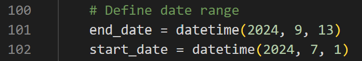
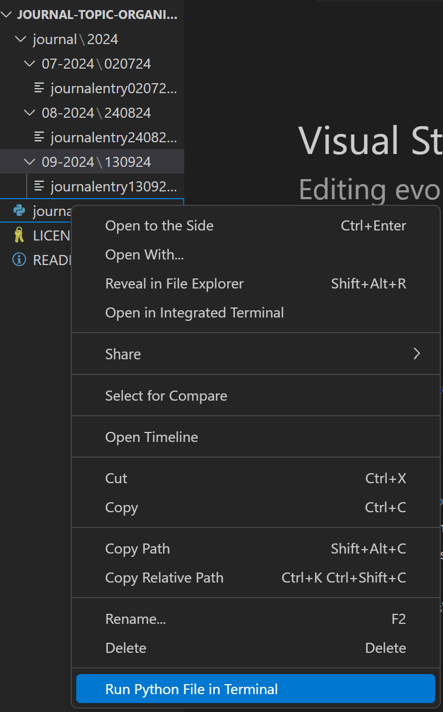

# journal-topic-organiser
A little bit of python that sorts journal entries into topics

## installation and use
1. [Install VS Code](https://code.visualstudio.com/) - that what I use to journal on text file
2. Open the script and choose the dates you want to sort
3. Right click the script and 'Run python in terminal'

## how it works 
The general idea is that you write journal entries and keep them all in a folder. Inside the entries, you can have topic headings to organise your thoughts, study, make shopping lists, whatever you want really. Then, when you want to create files that sort these topics, you run the script and choose the folder where the journal entries are stored. having folders in the main folder is fine. 

## entry format 
the scripts looks for "---" on either side of your topic heading to sift out topics into topic text files so make sure to name you topics like that each time. for example, "---hunting for decent pubs---".

adding DDMMYY at the end of your entries - the current script looks for the date at the end of your journal entries and sorts them accordingly. make sure to include this format at the end of your txt files e.g. myjournalentry130924.txt.

## roadmap
This is working completely fine for me as is, but if there's interest, here are a few things I might do: 

5 stars - Make script runnable as a standalone application on a new device without any prerequisites
10 stars - Include some templates for journaling + any incoming suggestions
50 stars - Include some templates for work routines i.e. creative writing, code copiloting with LLMs
100 stars - Build UI components to make the process more visual. 

## thanks 
Big inspo for this came from Derek Sivers. Here's an article on the [Benefits of a daily diary and topic journals](https://sive.rs/dj)

## collabs
If anyone is keen to jam on the code have a go! I've been using this for a while and it really works for me but any ideas are always welcome. Happy Journaling :)

## license

This project is licensed under the Creative Commons Attribution-NonCommercial 4.0 International License - see the [LICENSE](LICENSE) file for details.

You are free to use, share, and adapt this work for non-commercial purposes, as long as you give appropriate credit and indicate if changes were made.
